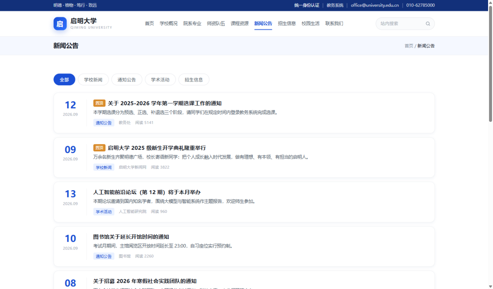
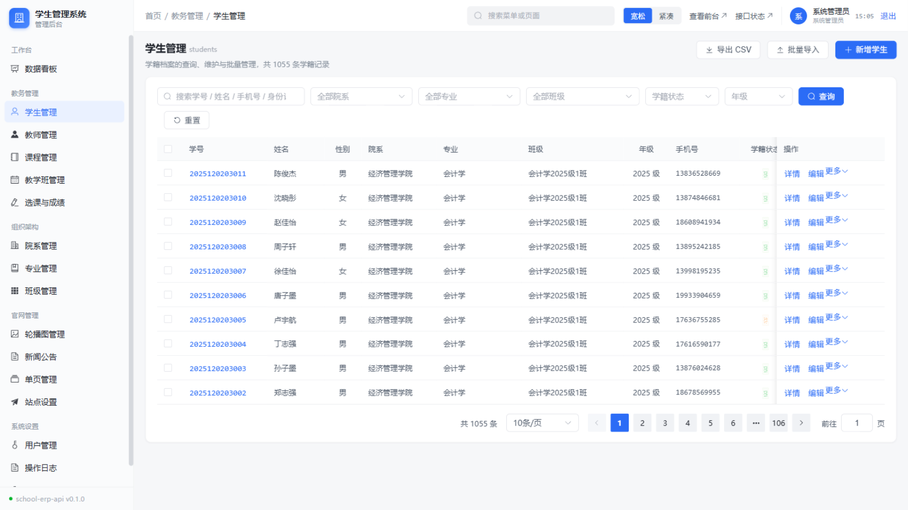
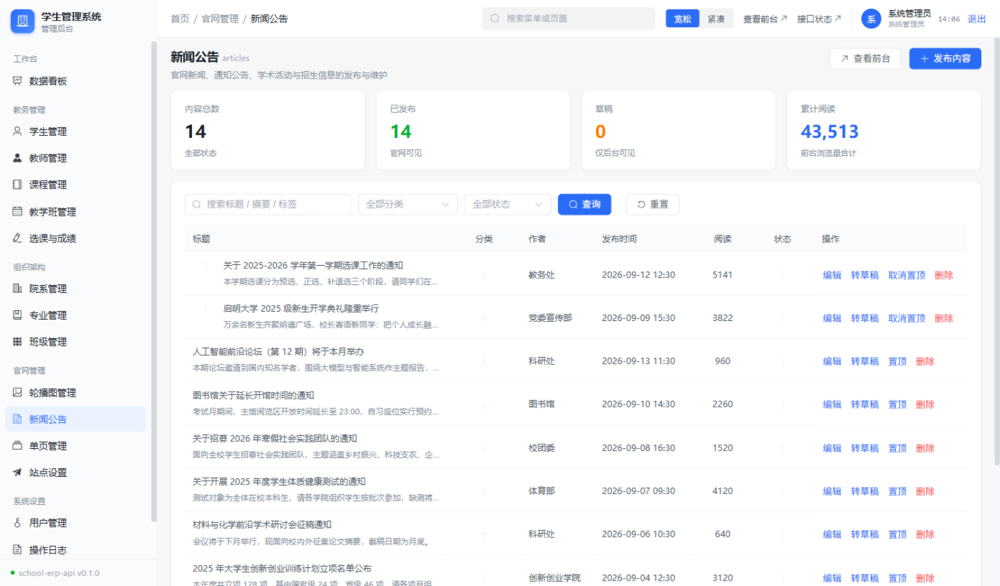

# 高校学生管理系统 · School ERP

一套可直接交付的大学教务信息化方案，包含**教务管理后台**、**学校官网**与**官网内容管理**三部分，
并提供「免安装绿色包」与「Windows 安装程序」两种交付形式 —— 目标电脑无需安装 Node.js、数据库或任何依赖。


---

## 界面预览

**学校官网**（明亮学院风，内容全部由后台维护）


**新闻公告**（分类筛选、置顶、阅读量）



**管理后台 · 数据看板**（指标卡、教务待办、6 张统计图）


**管理后台 · 学生管理**（多条件检索、批量导入导出、档案详情）



**管理后台 · 官网内容管理**（草稿/发布、置顶、SEO、阅读量）



---

## 目录

- [一、功能一览](#一功能一览)
- [二、技术栈](#二技术栈)
- [三、快速开始](#三快速开始)
- [四、部署](#四部署)
- [五、目录结构](#五目录结构)
- [六、接口一览](#六接口一览)
- [七、数据模型](#七数据模型)
- [八、角色权限矩阵](#八角色权限矩阵)
- [九、自测与构建](#九自测与构建)
- [十、多端适配与动效](#十多端适配与动效)
- [十一、视觉设计说明](#十一视觉设计说明)
- [十二、常见问题](#十二常见问题)
- [十三、二次开发提示](#十三二次开发提示)
- [许可证](#许可证)

---

## 一、功能一览

### 管理后台

| 模块 | 能力 |
| --- | --- |
| 数据看板 | 核心指标卡、教务待办提醒、6 张统计图（院系分布 / 招生趋势 / 成绩分段 / 学籍状态 / 热门课程 / 教师开课量）、最近新增学生 |
| 学生管理 | 多条件检索（院系·专业·班级·学籍状态·年级·关键字）、增删改、档案详情（含成绩单与学分统计）、**CSV 批量导入 / 导出**、批量删除、重置密码 |
| 教师管理 | 职称·院系·在职状态筛选、增删改、授课教学班一览、重置密码；**新增教师自动开通登录账号** |
| 课程管理 | 课程库维护（代码、学分、学时、类型、开课院系），可被多个教学班引用 |
| 教学班管理 | 按学期开课，指定教师·面向班级·教室·时间·容量；面向行政班开课时**自动把该班在读学生加入名单**；名单抽屉内直接录分、增删学生 |
| 选课与成绩 | 全量选课记录检索、**表格内在线录入成绩**（底部固定栏提示未保存修改）、按学期/教师/成绩状态/仅看不及格筛选、退选 |
| 组织架构 | 院系 / 专业 / 班级三级维护，删除带引用保护 |
| 官网管理 | 新闻公告（分类·草稿/发布·置顶·**标题与 SEO**·正文 HTML 编辑带预览·阅读量）、轮播图（排序·发布状态）、单页（自定义 slug 与 SEO）、站点设置（名称·校训·SEO·联系方式·备案号，保存即生效） |
| 系统设置 | 用户管理（角色分配、绑定档案、启停用、重置密码）、操作日志（写操作全审计）、个人资料（改资料/改密码/关联档案） |

### 学校官网

首页（轮播首屏 · 快捷入口 · 数字启明数据墙 · 新闻+公告 · 院系导览 · 师资风采 · 开放日 CTA）、
新闻公告列表与详情、院系与专业、师资队伍、课程资源、学校概况 / 招生信息 / 校园生活 / 联系方式等单页、
站内搜索、404 页。全站响应式，动态设置 `<title>` 与 `description`。

---

## 二、技术栈

| 层次 | 选型 | 说明 |
| --- | --- | --- |
| 后端 | Node.js 22+ / Express 4 / TypeScript | 经典分层：routes → service → db，统一响应体、Zod 校验、JWT 鉴权、操作日志 |
| 数据库 | SQLite（`node:sqlite` 内置模块） | Node 22.5+ 自带，**零原生依赖、零安装**，不需要 MySQL |
| 管理后台 | Vue 3 / Vite 6 / Element Plus / Pinia | 通过设计令牌统一改造视觉规范 |
| 学校官网 | Vue 3 / Vite 6 / 自定义 SCSS | 不引入组件库，独立设计语言 + 动态 SEO |
| 图表 | ECharts 5 | 仪表盘统计图 |
| 工程 | pnpm workspace（monorepo） | `server` / `web` / `site` 三个包 |
| 部署 | 自包含包 + NSIS | 免安装绿色包与 Windows 安装程序，均内置 Node 运行时 |

> 选 SQLite 是为了「一条命令跑起来」。数据访问层集中在 `server/src/db/index.ts`，
> 换成 MySQL / PostgreSQL 只需替换这一层与少量 SQL 方言，业务代码基本不动。

---

## 三、快速开始

```bash
# 1. 安装依赖（Node 22.5 以上）
pnpm install

# 2. 初始化数据库并写入演示数据
#    （约 1000 名学生、5900 条选课成绩、14 篇官网文章）
pnpm db:reset

# 3. 一键启动三端：API :8000 / 后台 :5173 / 官网 :5174
pnpm dev
```

也可分开启动：`pnpm dev:server` / `pnpm dev:web` / `pnpm dev:site`

### 演示账号

| 角色 | 账号 | 密码 | 登录后可见 |
| --- | --- | --- | --- |
| 系统管理员 | `admin` | `admin123` | 全部功能（含官网管理） |
| 教师 | `T0001` | `123456` | 教务管理（无删除权）、教师中心 |
| 学生 | `2024080901001` | `123456` | 学生中心（我的课程 / 我的成绩） |

> 全部教师账号 = 工号（T0001~T0048），全部学生账号 = 学号，初始密码统一 `123456`。

---

## 四、部署

提供三种方式，按目标环境选择。

### 4.1 免安装包 / Windows 安装程序（推荐，目标电脑无需任何环境）

```bash
pnpm package       # 生成免安装绿色包 release/school-erp-<版本>-win-x64.zip
pnpm installer     # 生成 Windows 安装程序 release/school-erp-<版本>-setup.exe
```

- **免安装包**：解压后双击 `启动服务.bat`（Linux/macOS 执行 `./start.sh`）
- **安装程序**：双击 setup.exe，向导式安装，可选桌面快捷方式，写入控制面板卸载项，卸载时可选择是否保留数据

两者共同点：

| 特性 | 说明 |
| --- | --- |
| 内置运行时 | 包内自带 Node 运行时（约 90 MB），目标机器无需安装 Node.js |
| 预装依赖 | 生产依赖已打包在内，部署时零安装、无需联网 |
| 自动建库 | 首次启动自动建表并写入演示数据 |
| 单进程三端 | 官网 `/`、后台 `/admin`、接口 `/api` 由同一进程同一端口提供 |
| 环境自愈 | `node/` 被误删时启动脚本自动联网补齐（官方源 → npmmirror → 清华镜像依次尝试） |
| 端口预检 | 端口被其它程序占用时给出明确指引，而不是抛 Node 报错栈 |
| 数据独立 | 全部数据在 `data/school-erp.db` 单文件内，复制即备份 |

启动后访问：官网 `http://localhost:8000/`、后台 `http://localhost:8000/admin`、接口索引 `http://localhost:8000/api`

### 4.2 源码一键部署（Windows）

```bash
一键部署.bat          # 自动补齐 Node → pnpm → 依赖 → 构建 → 启动
```

对应 `scripts/deploy.ps1`，可选 `-SkipStart`（只构建不启动）、`-ResetDb`（重建数据库）。

### 4.3 手动部署

```bash
pnpm install && pnpm build
cp -r web/dist server/public/admin
cp -r site/dist server/public/site
NODE_ENV=production node server/dist/server.js
```

也可把 `web/dist`、`site/dist` 交给 Nginx 托管，`/api` 反向代理到后端。

### 4.4 部署说明

- **编码**：打包脚本会把 `启动服务.bat` 转为 GBK、`.ps1` 转为 UTF-8 BOM。
  这是必须的 —— Windows 命令行按系统代码页解析批处理，UTF-8 中文会把 `if` 语句块拆散；
  PowerShell 5.1 也会把无 BOM 的 `.ps1` 当作 ANSI 读取。请勿改回 UTF-8。
- **正式使用前**：修改 `.env` 中的 `JWT_SECRET`，并调整演示账号密码。
- **换端口**：改 `.env` 的 `PORT` 即可，前端全部使用相对路径，无需重新构建。

---

## 五、目录结构

```
SChool_ERP/
├── package.json                  # 根工程（pnpm workspace + 一键脚本）
├── pnpm-workspace.yaml
├── 一键部署.bat                   # 源码一键部署（Windows，GBK 编码）
├── docs/images/                  # README 截图
├── .github/workflows/ci.yml      # CI：类型检查 + 构建 + 接口冒烟 + 打产物
├── scripts/
│   ├── package.mjs               # 打包免安装绿色包（含内置 Node 运行时）
│   ├── make-installer.mjs        # 制作 Windows 安装程序（自动获取 NSIS）
│   ├── make-assets.mjs           # 纯代码生成图标与安装向导位图
│   ├── deploy.ps1                # 源码一键部署逻辑
│   └── templates/                # 启动脚本 / 安装脚本 / 运行时自愈脚本模板
├── server/                       # 后端 API
│   ├── scripts/api-smoke.mjs     # 接口冒烟测试（69 项断言）
│   └── src/
│       ├── server.ts             # 启动入口（自动建表 + 空库自动灌数据）
│       ├── app.ts                # Express 装配（含前端静态托管）
│       ├── db/                   # schema.sql / 连接封装 / migrate / seed / seed-cms
│       ├── middlewares/          # 鉴权、错误处理、操作日志
│       ├── modules/              # 业务模块（每个模块 service + routes）
│       │   ├── auth/ dashboard/ student/ teacher/ course/ offering/
│       │   ├── enrollment/ department/ major/ classGroup/ user/ log/
│       │   ├── publicSite/       # 官网公开接口
│       │   └── cms/              # 官网内容管理
│       ├── routes/               # 路由汇总 + /meta、/health、接口索引页
│       └── utils/                # 响应体、SQL 组装、分页、JWT、密码、HTML 净化
├── web/                          # 管理后台
│   └── src/{api,components,layout,router,stores,styles,utils,views}
└── site/                         # 学校官网
    └── src/{api,components,directives,router,store,styles,views}
```

---

## 六、接口一览

统一响应体 `{ code, message, data }`，业务失败返回非 0 `code` 与对应 HTTP 状态码。
直接访问 `http://localhost:8000/api` 可看到可浏览的**接口索引页**。

<details>
<summary>展开完整接口表</summary>

### 服务与认证

| 方法 | 路径 | 说明 |
| --- | --- | --- |
| GET | `/api` `/api/health` `/api/meta` | 接口索引 / 健康检查 / 服务元信息 |
| POST | `/api/auth/login` `/api/auth/logout` | 登录 / 退出 |
| GET/PUT | `/api/auth/profile`；PUT `/api/auth/password` | 个人资料 / 修改密码 |

### 教务与系统（需登录）

| 方法 | 路径 | 说明 |
| --- | --- | --- |
| GET | `/api/dashboard/overview` | 仪表盘聚合数据 |
| GET/POST/PUT/DELETE | `/api/students` | 学生 CRUD（含 `/statistics`） |
| POST | `/api/students/import` `/batch-delete`；GET `/export` | 导入 / 批量删除 / 导出 CSV |
| GET/POST/PUT/DELETE | `/api/teachers` `/api/courses` `/api/offerings` | 教师 / 课程 / 教学班 |
| POST | `/api/offerings/:id/students` | 教学班添加学生 |
| GET | `/api/enrollments` `/overview` | 选课记录 / 统计 |
| POST | `/api/enrollments/batch-score` | **批量录入成绩** |
| GET | `/api/enrollments/my-courses` `/my-scores` `/my-teachings` | 学生 / 教师视角 |
| GET/POST/PUT/DELETE | `/api/departments` `/majors` `/classes` | 组织架构 |
| GET/POST/PUT/DELETE | `/api/users`；GET/DELETE `/api/logs` | 账号管理 / 操作日志 |

### 官网公开接口（无需登录）

| 方法 | 路径 | 说明 |
| --- | --- | --- |
| GET | `/api/public/site` `/banners` `/headline` | 站点信息 / 轮播图 / 首页要闻 |
| GET | `/api/public/articles` `/articles/:id` | 文章列表 / 详情（浏览量自增） |
| GET | `/api/public/pages/:slug` | 单页内容 |
| GET | `/api/public/departments` `/teachers` `/courses` | 院系专业 / 师资 / 课程 |
| GET | `/api/public/search` | 站内搜索 |

### 官网内容管理（仅管理员）

| 方法 | 路径 | 说明 |
| --- | --- | --- |
| GET/POST/PUT/DELETE | `/api/cms/banners` | 轮播图；`POST /:id/move` 排序 |
| GET/POST/PUT/DELETE | `/api/cms/articles` | 文章；`/:id/toggle-status` 发布切换、`/:id/toggle-top` 置顶 |
| GET/POST/PUT/DELETE | `/api/cms/pages` | 单页管理 |
| GET/PUT | `/api/cms/settings` | 站点设置 |

</details>

---

## 七、数据模型

```
department 院系 ─┬─< major 专业 ──< class_group 班级 ──< student 学生
                 ├─< teacher 教师 ──< course_offering 教学班 >── course 课程
                 └─< course 课程            │
                                            └──< enrollment 选课与成绩 >── student
sys_user 系统账号（role = admin/teacher/student，ref_id 关联教师或学生档案）
sys_log 操作日志        sys_setting 系统参数

cms_banner 轮播图       cms_article 新闻公告      cms_page 单页      cms_setting 站点设置
```

设计要点：

- **学号 / 工号即登录账号**，新增学生或教师时自动开通账号（初始密码 123456）
- `enrollment` 对 `(offering_id, student_id)` 建唯一约束，避免重复选课
- 面向行政班开课时自动批量选课，减少教务重复操作
- 删除操作有引用保护（院系下有专业、专业下有班级、教学班已录成绩等都会被拦截并提示）
- 官网正文 HTML 保存时做**标签净化**（移除 script / iframe / 事件属性 / 危险协议），防存储型 XSS
- 官网公开接口只返回 `已发布` 内容，草稿仅后台可见

---

## 八、角色权限矩阵

| 功能 | 管理员 | 教师 | 学生 | 游客 |
| --- | :---: | :---: | :---: | :---: |
| 学校官网全部页面 | ✅ | ✅ | ✅ | ✅ |
| 仪表盘 | ✅ | ✅ | ✅ | ❌ |
| 学生 / 教师名册（读） | ✅ | ✅ | ❌ | ❌ |
| 学生 / 教师 / 课程 / 教学班（写） | ✅ | ✅ | ❌ | ❌ |
| 删除类操作 | ✅ | ❌ | ❌ | ❌ |
| 选课记录与成绩录入 | ✅ | ✅（限本人授课教学班） | ❌ | ❌ |
| 组织架构维护 | ✅ | 班级可写 | ❌ | ❌ |
| 官网内容管理（CMS） | ✅ | ❌ | ❌ | ❌ |
| 用户管理 / 操作日志 | ✅ | ❌ | ❌ | ❌ |
| 我的课程 / 我的成绩 | — | — | ✅ | ❌ |

权限在路由层通过 `authenticate` + `requireRole(...)` 声明，前端菜单由路由 `meta.roles` 自动收敛，两侧一致。

---

## 九、自测与构建

```bash
pnpm typecheck                       # 三包类型检查（tsc + vue-tsc）
pnpm build                           # 三包生产构建
node server/scripts/api-smoke.mjs    # 接口冒烟测试（需后端已启动）
```

冒烟测试共 **69 项断言**，覆盖：基础接口、登录鉴权、错误密码与越权拦截、各模块列表、
组织架构增删改闭环、学生档案全流程、选课与成绩录入、非法参数拦截、三角色权限校验、
CSV 导出、官网公开接口、CMS 发布闭环（草稿不可见 → 发布可见 → 置顶 → 删除）、
站点设置实时生效、内置单页删除保护。

`.github/workflows/ci.yml` 会在 push / PR 时自动跑上述检查；
推送 `v*` 标签或手动触发时，还会在 Windows 上构建免安装包与安装程序，
把产物作为 Artifact 上传并自动附加到 GitHub Release。

---

## 十、多端适配与动效

### 断点策略

| 断点 | 管理后台 | 学校官网 |
| --- | --- | --- |
| > 1280px | 完整侧边栏 + 头部搜索/密度切换/服务状态 | 横向导航（9 栏目）+ 站内搜索 |
| 1024–1280px | 侧边栏保留，头部精简 | 导航收起为汉堡菜单 |
| 768–1024px | **侧边栏改为抽屉**（汉堡展开、遮罩关闭、选中自动收起）；弹窗宽度 92%、抽屉 94%；统计卡 2 列 | 栅格降为 2 列，首屏压缩 |
| < 768px | 筛选条件铺满整行；底部保存栏上下排列；分页只留页码；表格改为容器内横向滑动 | 单列布局；页脚单列；回到顶部缩为图标 |

交互适配：移动端抽屉支持「遮罩点击关闭 / 选择菜单后自动关闭 / 路由变化自动关闭」；
可点击元素在触屏下保持 ≥34px 命中区域；表格固定操作列保证手机上按钮始终可见。

### 动效

| 场景 | 处理 |
| --- | --- |
| 页面切换 | **CSS keyframes 入场动画**。刻意不用 `<Transition mode="out-in">`：它会等离场动画结束才渲染新页面，动画帧一旦被推迟（后台标签页、嵌入式浏览器）就会出现"地址变了但页面没换"的卡死 |
| 长页面 | `v-reveal` 滚动入场指令，卡片按索引错峰延迟；带**有界兜底**（滚动事件 + 20 秒内周期检查），内容永远不会被动画隐藏 |
| 数字 | `CountUp` 组件用 requestAnimationFrame + 缓出曲线滚动到目标值，并有超时落位兜底 |
| 反馈 | 卡片悬浮抬升 + 顶部渐变高光、表格行过渡、底部保存栏脏状态提示、轮播交叉淡入 |
| 无障碍 | 全站尊重 `prefers-reduced-motion`，系统开启「减少动态效果」时关闭动画直接展示 |

---

## 十一、视觉设计说明

项目包含两套独立的设计语言，分别在 `web/src/styles/index.scss` 与 `site/src/styles/index.scss`。

### 管理后台：浅色极简

对齐参考稿（网站内容管理系统）的设计语言：

| 元素 | 实现 |
| --- | --- |
| 侧边栏 | 浅灰底、业务分组的小号灰色分组标题、圆角高亮选中项、底部版本号 `school-erp-api v0.1.0` |
| 头部 | 面包屑 `首页 / 分组 / 页面`；右侧菜单搜索、显示密度切换、**查看前台**、服务状态弹层、用户信息与时钟 |
| 卡片面板 | 白底 + 1px 浅边 + 10px 圆角 + 极轻投影；标题为「中文 + 英文小字」 |
| 表单 | 字段标签「中文 + 英文小字」+ 灰色说明（`field` / `field-label` / `field-hint`） |
| 底部固定栏 | 左侧状态点（绿=已是最新，橙=有未保存修改），右侧「放弃修改 / 保存」 |

「有未保存的修改」采用**服务端快照比对**（baseline 快照 vs 当前编辑值），不依赖组件 change 事件，改回原值会自动取消脏标记。

### 学校官网：明亮学院风 + 科技细节

| 维度 | 做法 |
| --- | --- |
| 底色 | 白底为主，`#f5f8fd` 浅蓝灰分区；顶部叠极浅网格并向下渐隐 |
| 强调色 | 电光蓝 `#1f5fe0` → 青 `#06b6d4` 渐变；紫 / 薄荷 / 琥珀仅用于状态与数据点缀 |
| 顶部与页脚 | 40px 深蓝状态条（校训 + 统一身份认证 / 教务系统入口），页脚深蓝信息区并以渐变线收边 |
| 卡片 | 白底 + 浅描边 + 柔和投影；悬浮抬升并展开顶部渐变高光条 |
| 首屏 | 浅色径向渐变 + 三层缓慢漂移光晕 + 透视网格地面 + 匀速扫描线；右侧是带进度条的编号轮播切换器 |
| 数据墙 | 「数字启明」整块为深色（`#071229 → #0c1c3c`），是全站唯一深色内容区，与上下白色区块形成节奏对比 |
| 微标签 | 章节标题上方统一等宽大写小字（`NEWS` / `NOTICES` / `FACULTY` / `ADMISSION`），字距 0.2em |

### 安装程序外观

图标与安装向导位图由 `scripts/make-assets.mjs` **纯代码绘制生成**
（多尺寸 ico + 164×314 品牌侧图 + 150×57 页眉图），不依赖图形库，也不需要外部素材文件。

---

## 十二、常见问题

**Q：启动后浏览器没有自动打开？**
手动访问 `http://localhost:8000/` 即可。

**Q：提示端口被占用？**
用记事本打开 `.env`，把 `PORT=8000` 改成 8080 等其它端口后重启（前端全用相对路径，无需重新构建）。

**Q：局域网内其它电脑如何访问？**
用本机 IP 替换 localhost，例如 `http://192.168.1.10:8000/`；若无法访问请检查防火墙是否放行该端口。

**Q：数据在哪里？怎么备份 / 重置？**
全部数据在 `data/school-erp.db` 单文件内。复制该目录即备份；删除 `data` 目录后重启会自动重新生成演示数据。

**Q：`启动服务.bat` 打开是乱码，或提示"不是内部或外部命令"？**
该文件必须是 **GBK 编码**（Windows 批处理按系统代码页解析）。请勿转成 UTF-8，否则 `if` 语句块会被拆散。
用 `pnpm package` 生成的文件已自动处理好编码。

**Q：能同时跑开发环境和部署包吗？**
默认都占用 8000 端口，冲突时部署包的启动脚本会给出提示。改其中一方的 `PORT` 即可共存。

**Q：换成 MySQL 麻烦吗？**
数据访问层集中在 `server/src/db/index.ts`（`all/get/run/transaction` 四个方法），
替换为 mysql2 / pg 后各 service 的 SQL 基本可复用。

---

## 十三、二次开发提示

- **加后台模块**：在 `server/src/modules/` 新建 `xxx.service.ts` + `xxx.routes.ts`，
  在 `routes/index.ts` 挂载；前端在 `router/index.ts` 增加一条带 `meta.group` 的路由，会自动出现在侧边栏。
- **加官网栏目**：后台「官网管理 → 单页管理」新建页面并发布，导航会自动追加；
  如需固定栏目，在 `site/src/components/SiteHeader.vue` 的 `menus` 中登记。
- **初始数据**：`server/src/db/seed.ts`（教务）与 `seed-cms.ts`（官网）使用固定随机种子，
  每次生成的数据完全一致，便于演示与截图对照。
- **环境变量**：复制 `server/.env.example` 为 `server/.env`，可改端口、JWT 密钥、数据库路径；
  `SQL_DEBUG=true` 会打印 SQL 日志。后台「查看前台」与官网「统一身份认证」的互跳地址由
  `web` 的 `VITE_SITE_URL` 与 `site` 的 `VITE_ADMIN_URL` 控制（打包脚本会自动注入为同源地址）。

---

## 许可证

[MIT](LICENSE)

演示数据中的学校、院系、师生姓名均为虚构，仅用于展示系统功能。
